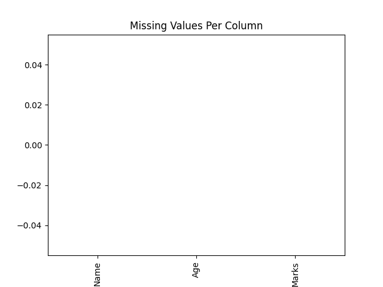

# Advanced Data Cleaner

Professional Data Cleaning Tool built with Python. Automatically handles missing values, generates reports, and visualizes data.


---

## Features
- Load CSV files and clean data automatically
- Handle missing values intelligently
- Generate visual reports (charts and tables)
- Export cleaned data to Excel
- User-friendly command line interface

---

## Screenshots

**Missing Values Visualization:**  


**Report Preview:**  


---

## Installation

1. Clone the repo:  
```bash
git clone https://github.com/neha-saini21/advanced_data_cleaner.git

